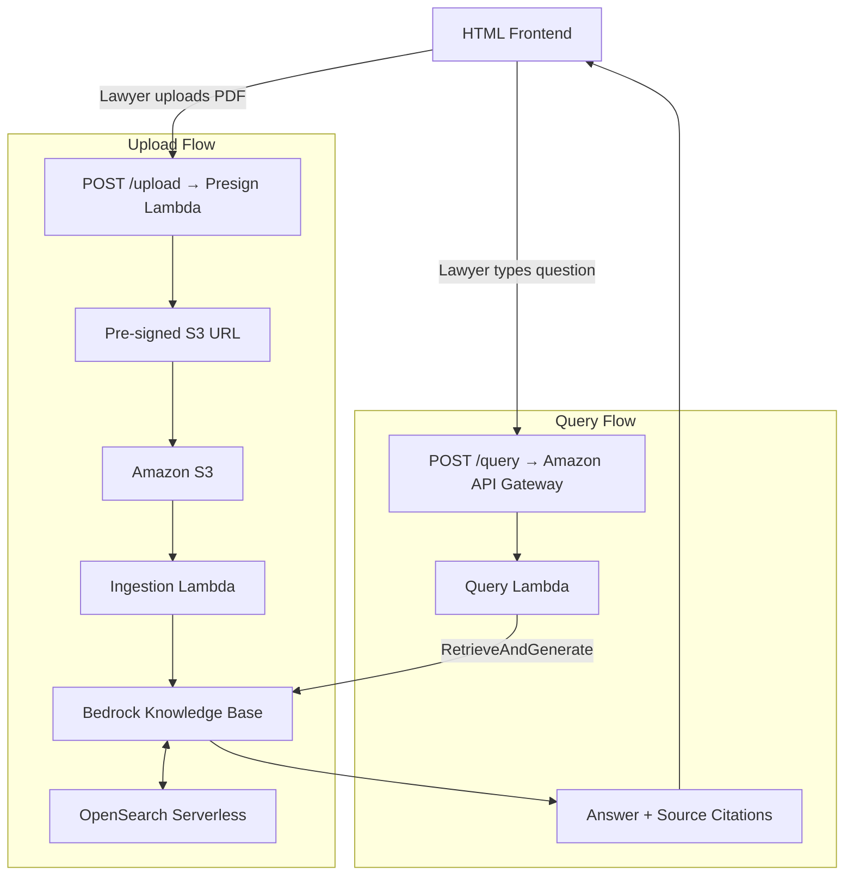

# AWS Bedrock RAG Pipeline

> This is the third project in my AWS portfolio. While my
> [previous project](https://github.com/nathanielkay11-tech/aws-ai-document-pipeline)
> built a serverless AI document processing pipeline, this one adds a
> retrieval layer on top of Bedrock — moving from "I can make infrastructure
> intelligent" to "I can make infrastructure answer questions."

---

## 🎬 Demo Video
[Watch the full demo on YouTube](https://youtu.be/Sdih82BqQtI)

---

## 🗺️ Project Navigation: The 3 Iterations

### 📍 Iteration 1: Architecture Design and ADRs
- **What it is:** The architecture design phase. See
  [`/docs/design-decisions.md`](./docs/design-decisions.md) for all
  architectural decision records covering service selection, vector store
  choice, and security design.
- **The Goal:** To design a production-quality RAG system from first
  principles — defining the retrieval strategy, chunking approach, and
  query architecture before writing a single line of code.
- **Status:** ✅ Complete — ADR-001 through ADR-017

### 📍 Iteration 2: Infrastructure Build and Testing
- **What it is:** Full Terraform IaC deployment of all AWS services,
  Lambda query handler development, and end-to-end testing across
  multiple query types and document sets.
- **The Goal:** To prove the architecture works in a real AWS environment
  — query accuracy, citation quality, and latency documented with
  evidence in [`/docs/testing-log.md`](./docs/testing-log.md).
- **Status:** ✅ Complete — 5/5 queries passed. See [`docs/test-results.md`](./docs/test-results.md)

### 📍 Iteration 3: One-Shot Reproduction Prompt
- **Status:** Not included in this project — the architecture complexity 
  of Bedrock Knowledge Bases and OpenSearch Serverless exceeds what can 
  be reliably reproduced in a single prompt. See the pipeline project for 
  a demonstration of this technique.

---

## 🏢 The Business Problem

European legal and procurement teams manage hundreds of contracts
simultaneously. Finding a specific clause — a liability cap, a
termination right, a renewal date — requires a lawyer to manually
open and read each document. At €250–400/hour for legal associate
time, this is expensive, slow, and doesn't scale.

This project automates that search layer. A question goes in.
A precise answer with source citations comes out — directly referencing
the relevant clause in the relevant document, without a human reading
through the entire contract library first.

---

## 💡 Why This Architecture — Design Decisions & Cost Analysis

### Architecture Alternatives Considered

Three approaches were evaluated before settling on the current design:

**Option 1: Fine-tuned foundation model (Rejected)**
Training a model on legal documents would produce a system with broad
knowledge of contract language but no ability to answer questions about
specific documents it wasn't trained on. Every new contract added would
require retraining. This fundamentally mismatches the use case — legal
teams need answers about their specific contracts, not general legal
knowledge.

**Option 2: Direct Bedrock invocation with documents in context (Rejected)**
Passing entire contract PDFs directly into a Bedrock prompt works for
single documents but breaks at scale. Large contracts exceed context
windows. Multiple documents simultaneously make costs prohibitive and
accuracy degrades as context grows. This approach doesn't scale beyond
a handful of short documents.

**Option 3: RAG with Bedrock Knowledge Bases — Current Architecture ✅**
Knowledge Bases handles chunking, embedding, and vector storage
automatically. At query time, only the relevant document chunks are
retrieved and passed to the model — keeping context lean, costs low,
and accuracy high regardless of how many documents are in the knowledge
base. The system scales from 10 contracts to 10,000 without
architectural changes.

---

### 📊 Projected Cost by Use Case Tier

#### Volume Definitions

| Tier | Monthly Queries | Organisation Profile |
| --- | --- | --- |
| 🟢 **Small** | 500–2,000 | Boutique law firm or startup in-house legal team |
| 🟡 **Mid-size** | 5,000–20,000 | Regional law firm or scale-up legal department |
| 🔴 **Large** | 50,000–200,000 | Magic Circle firm or multinational legal function |

---

#### Monthly Cost Estimates

All figures based on current AWS eu-west-1 pricing (May 2026). Assumes
average query generates ~1,500 input tokens and ~500 output tokens,
with 5 document chunks retrieved per query.

| Service | Small (2,000/mo) | Mid (20,000/mo) | Large (200,000/mo) |
| --- | --- | --- | --- |
| Amazon Bedrock (Claude Sonnet) | ~€5 | ~€40 | ~€350 |
| OpenSearch Serverless | ~€25 | ~€25 | ~€80 |
| AWS Lambda | <€1 | ~€2 | ~€15 |
| Amazon API Gateway | <€1 | ~€1 | ~€8 |
| Amazon S3 | <€1 | <€1 | ~€5 |
| CloudWatch Logs | <€1 | ~€2 | ~€10 |
| **Total Monthly** | **~€32** | **~€71** | **~€468** |
| **Cost per query** | **~€0.016** | **~€0.004** | **~€0.002** |

> ⚠️ These are indicative estimates. Bedrock token usage will vary
> based on query complexity and document length. Always validate with
> the [AWS Pricing Calculator](https://calculator.aws/pricing/2/home)
> for production budgeting.

---

#### Cost vs. Manual Review Benchmark

European legal associate rates: €250–400/hour. Average time to manually
locate and extract a specific clause across a contract library: 20–30
minutes per query.

| Volume | Manual Review Cost | Pipeline Cost | Saving |
| --- | --- | --- | --- |
| 2,000 queries/month | ~€17,000 | ~€32 | **99.8%** |
| 20,000 queries/month | ~€170,000 | ~€71 | **99.9%** |
| 200,000 queries/month | ~€1,700,000 | ~€468 | **99.9%** |

The pipeline doesn't replace legal judgement — complex contract
interpretation still requires a lawyer. It eliminates the document
search layer entirely, freeing legal staff to focus on analysis
rather than retrieval.

---

## 🏗️ Architecture Overview

---

## 🚀 Project Status

✅ Iteration 1 complete — architecture design and ADRs (ADR-001 through ADR-017)

✅ Iteration 2 complete — infrastructure deployed, tested, and demo recorded

**Built:**
- Full Terraform infrastructure — S3, OpenSearch Serverless, Bedrock Knowledge Base, Lambda, API Gateway
- Presign Lambda — secure browser-to-S3 upload with pre-signed URLs
- Ingestion Lambda — automated document ingestion with S3 path metadata extraction
- Query Lambda — RetrieveAndGenerate with matter filter and source citations
- HTML Frontend — Vandermeer & Associates Document Intelligence Platform

Test plan: [`docs/testing-log.md`](./docs/testing-log.md)
Test data manifest: [`docs/test-data-manifest.md`](./docs/test-data-manifest.md)
Test results: [`docs/test-results.md`](./docs/test-results.md)

---

## ✅ Testing Results

5/5 queries passed. Full results in [`docs/test-results.md`](./docs/test-results.md).

| Test | Query Type | Result |
| --- | --- | --- |
| TEST-Q-001 | Precision query | ✅ Passed |
| TEST-Q-002 | Cross-document query | ✅ Passed |
| TEST-Q-003 | Synthesis query | ✅ Passed |
| TEST-Q-004 | Bilingual query | ✅ Passed |
| TEST-Q-005 | Error query | ✅ Passed |

---

## ⚠️ Known Limitations

The following limitations apply to Phase 1. Full details and
Phase 2 solutions are documented in
[`docs/phase-two-additions.md`](./docs/phase-two-additions.md).

- **Ethical Walls** — no access control. All users can query
  all documents. Phase 1 suitable for firms where all staff
  access all matters only. See Phase 2B.
- **GDPR** — partial compliance. Encryption at rest and private
  access implemented. Data subject rights and formal DPAs not
  included. See Phase 2D.
- **Document Retention** — not enforced. No S3 lifecycle policy
  preventing deletion within legal retention periods. See Phase 2E.
- **Audit Trail** — not implemented. No query logging. Not
  suitable for firms with compliance or billing requirements.
  See Phase 2C.
- **Frontend** — runs locally only. Not suitable for multi-user
  production deployment without Phase 2 CloudFront hosting.
- **Batch Upload** — single file upload only. Each document
  requires individual matter ID and uploader name input.
  Batch upload deferred to Phase 2F.
- **Uploader Identity** — uploader name is manually entered,
  not authenticated. Phase 2B Cognito integration captures
  uploader identity automatically from the logged-in account.
- **Multilingual Document Viewing** — answers returned in English
  regardless of source document language. Viewing source clauses
  in translated form deferred to Phase 2H.

---

## 🤖 Development Approach

This project was developed using an AI-assisted workflow. Claude
(Anthropic) was used as a technical sounding board throughout the
build — helping with code structure, troubleshooting, and
documentation. All architectural decisions, business logic,
security considerations and project direction were driven by me.

This reflects how modern cloud engineers actually work in 2026 —
knowing how to leverage AI tools effectively is itself a
professional skill.